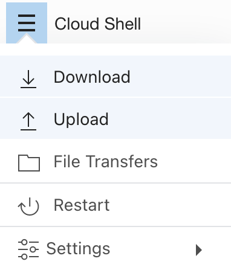
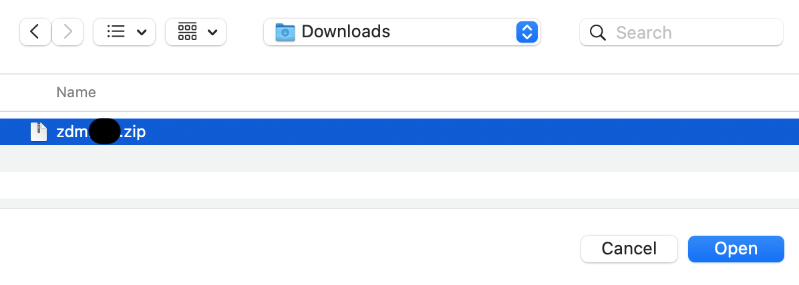
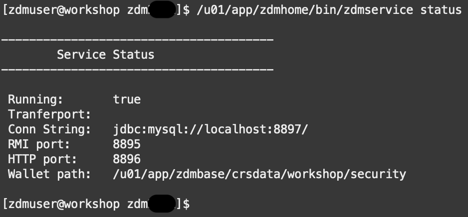
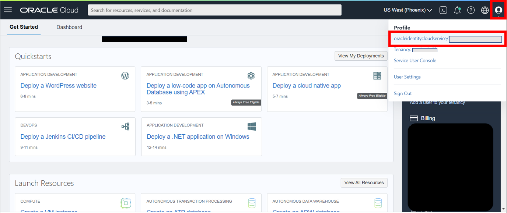
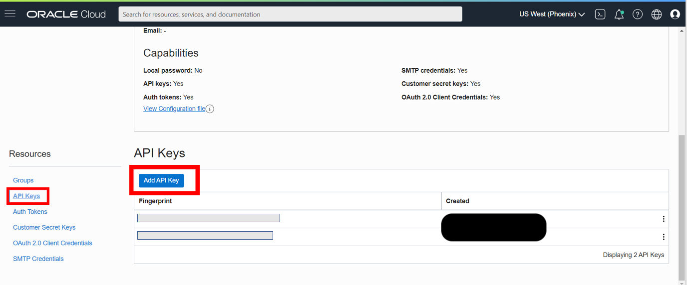
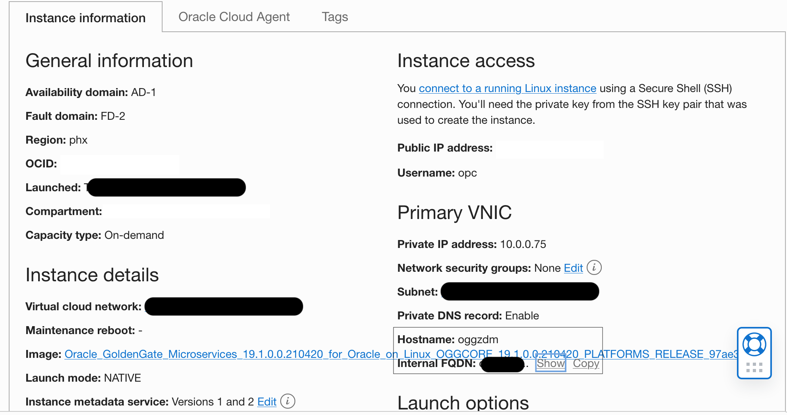

# Configure the ZDM Environment

## Introduction
In this lab on your host instance, you will:
* Install Oracle Cloud Infrastructure Command Line Interface (Oracle Cloud Infrastructure CLI)
* Create a Zero Downtime Migration (ZDM) group and user
* Add directories for ZDM  
* Install and Start ZDM
* Generate API keys
* Create your Oracle Cloud Infrastructure directories and configuration files under all 3 users: 'zdmuser', 'oracle', and 'opc'
* Create RSA keys


The CLI is a small-footprint tool that you can use on its own or with the Console to complete Oracle Cloud Infrastructure tasks. The CLI provides the same core functionality as the Console, plus additional commands. Some of these, such as the ability to run scripts, extend Console functionality.

The API keys you are generating are to allow the Oracle Cloud Infrastructure CLI you installed on your host instance to connect to your Oracle Cloud Infrastructure user profile to run commands. The RSA keys will allow you to SSH connect directly to 'oci' from 'zdmuser' which will be needed when running the Zero Downtime Migration.

The reason your Oracle Cloud Infrastructure directory is being copied to 'zdmuser', 'oracle', and 'opc' is so that each of these 3 users can utilize the Oracle Cloud Infrastructure CLI.

Estimate Lab Time: 20 minutes

### Objectives

In this lab, you will:
* Learn how to congifute the ZDM Service Node, generate and configure the required API Keys and configure connectivity between ZDM's Service Node and the GoldenGate Hub. 

### Prerequisites
* This workshop section requires having completed all previous workshop sections.

**Disclaimer**: Throughout the workshop there will be locations where you are copying and pasting multiple lines of code at a time from the instructions into SQLPlus. However, the last line pasted will not commit until you manually press enter a second time. To avoid statement failure, please be cognizant of this and press enter twice when pasting.

## Task 1: Install Oracle Cloud Infrastructure CLI
1. Return to your compute instance command prompt as 'opc'. If you navigated away while creating your target database, you can reconnect through your command prompt with the following command. Replace < sshkeyname > and < Your Compute Instance Public IP Address > with the key file name and IP address of your source compute instance:

    ```
    <copy>
    ssh -i ~/.ssh/<sshkeyname> opc@<Your Compute Instance Public IP Address>
    </copy>
    ```


2. Install Oracle Cloud Infrastructure CLI. Respond y at the prompt.

    ```
    <copy>
    sudo yum install python36-oci-cli
    </copy>
    ```

## Task 2: Set ZDM Group and User and Create Directories
1. Run code below to add the group zdm, create the user zdmuser, and add directories for the ZDM. Please bear in mind that enter must be needed to enter twice after having copied the below statement. 

    ```
    <copy>
    sudo groupadd zdm
    sudo useradd -g zdm zdmuser
    sudo mkdir /u01/app/zdmhome
    sudo mkdir /u01/app/zdmbase
    sudo mkdir /u01/app/zdmdownload
    sudo chown zdmuser:zdm /u01/app/zdmhome
    sudo chown zdmuser:zdm /u01/app/zdmbase
    sudo chown zdmuser:zdm /u01/app/zdmdownload
    </copy>
    ```

## Task 3: Install Zero Downtime Migration
1. As 'opc' check that the following packages are installed:
    * expect
    * glib-devel
    * oraclelinux-developer-release-el7

    Run the below command to check each of the 3 packages above. Please bear in mind that enter must be needed to enter twice after having copied the below statement :

    ```
    <copy>
    rpm -qa | grep expect
    rpm -qa | grep glib-devel
    rpm -qa | grep oraclelinux-developer-release-el7
    </copy>
    ```

    If any of the packages are missing run the following command replacing `<package>` with the missing package name:

    ```
    <copy>
    sudo yum install <package>
    </copy>
    ```


2. Let's download the ZDM binaries to your local machine (laptop) and then scp / sftp it to the compute node where the ZDM Service node will be deployed. Copy the following link and open it in your favorite browser:

    ```
    <copy>
    https://www.oracle.com/database/technologies/rac/zdm-downloads.html
    </copy>
    ```

3. Bear in mind you must be signed in to perform a download, please proceed to sign if you have not done so. Once signed in, click on Download, Accept the Licensing terms and download the ZDM binaries to your Desktop

    

    


4. Go back to your Cloud Shell environment and click on the navigation menu on the top left of Cloud Shell and click on the __Upload__ option, an upload window will appear

    

    


5. Click on __select from your computer__, select the recently ZDM downloaded binaries and click __Upload__


    


6. Upon finalizing the upload process, click on __Hide__, then exit the opc user:

    ```
    <copy>
    exit
    exit
    </copy>
    ```

7. Once you are back in your Cloud Shell root, move the file to a /tmp folder under the opc user. Replace < sshkeyname > and < Your Compute Instance Public IP Address > with the key file name and IP address of your source compute instance:

    ```
    <copy>
    scp -i ~/.ssh/<sshkeyname> zdm21.2.zip opc@<Your Compute Instance Public IP Address>:/tmp
    </copy>
    ```

8. Return to your compute instance command prompt as 'opc'.  Replace < sshkeyname > and < Your Compute Instance Public IP Address > with the key file name and IP address of your source compute instance:

    ```
    <copy>
    ssh -i ~/.ssh/<sshkeyname> opc@<Your Compute Instance Public IP Address> 
    </copy>
    ```    

9. Switch to 'zdmuser' .

    ```
    <copy>
    sudo su - zdmuser
    </copy>
    ```


10. Cd to the /tmp folder, copy the zdm binaries to the zdmdownload file and, unzip the files and cd to the unziped directory. Bear in mind that at the time of creation of this workshop ZDM's current version was 21.2, if a newer version is available, please change the commands from 21.2 to the current version so that the unzip proceeds correctly: 

     ```
    <copy>
    cd /tmp
    cp zdm21.2.zip /u01/app/zdmdownload
    cd /u01/app/zdmdownload
    unzip zdm21.2.zip
    cd zdm21.2
    </copy>
    ```


11. Run the install and start the service.

    Install ZDM:

    ```
    <copy>
    ./zdminstall.sh setup oraclehome=/u01/app/zdmhome oraclebase=/u01/app/zdmbase ziploc=/u01/app/zdmdownload/zdm21.2/zdm_home.zip -zdm
    </copy>
    ```

    Start ZDM service:

    ```
    <copy>
    /u01/app/zdmhome/bin/zdmservice start
    </copy>
    ```

    Check its status:

    ```
    <copy>
    /u01/app/zdmhome/bin/zdmservice status
    </copy>
    ```

    

## Task 4: Generating API Keys
1. As 'zdmuser' go to 'zdmhome' directory.

    ```
    <copy>
    cd /u01/app/zdmhome
    </copy>
    ```

2. Create your .oci directory and generate your API keys. Copy the catted 'oci\_api\_key\_public.pem' file to your clipboard. During the copy, include the "Begin Public Key" and "End Public Key" lines.

    ```
    <copy>
    mkdir .oci
    cd .oci
    openssl genrsa -out /u01/app/zdmhome/.oci/oci_api_key.pem 2048                        
    openssl rsa -pubout -in /u01/app/zdmhome/.oci/oci_api_key.pem -out /u01/app/zdmhome/.oci/oci_api_key_public.pem
    cat oci_api_key_public.pem
    </copy>
    ```

3. On your Oracle Cloud Infrastructure Dashboard navigate to and click on your user profile in the top right. Select the top option, your user.
    

4. Select 'API Keys' and 'Add API Key'.
    

5. Paste your public Oracle Cloud Infrastructure API key file you copied above and click "Add Key".
    

6. You will see a configuration file preview. Copy its contents to clipboard. You will be using it to populate your configuration file in the following step.
    

## Task 5: Creating Your Configuration File and Copying Your Directory
1. Back in your command prompt create your config file.

    ```
    <copy>
    vi config
    </copy>
    ```

2. 'i' command lets you insert text into the file.

    ```
    <copy>
    i
    </copy>
    ```

3. Paste the config file preview contents that were copied to clipboard into the file.

4. Replace < path to your private keyfile > # TODO with:

    ```
    <copy>
    /u01/app/zdmhome/.oci/oci_api_key.pem
    </copy>
    ```

    

5. Press the escape key to escape insert.

6. To save and quit vi editor.

    ```
    <copy>
    :wq!
    </copy>
    ```

    If you need to leave vi editor without saving.

    ```
    <copy>
    :q!
    </copy>
    ```

7. Copy ''.oci' to 'opc'. Start by switching from 'zdmuser' to 'opc'.

    ```
    <copy>
    exit
    </copy>
    ```

8. Go to root directory and make .oci directory.

    ```
    <copy>
    cd ~
    mkdir .oci
    cp /u01/app/zdmhome/.oci/config /home/opc/.oci
    cp /u01/app/zdmhome/.oci/oci_api_key.pem /home/opc/.oci
    cp /u01/app/zdmhome/.oci/oci_api_key_public.pem /home/opc/.oci
    </copy>
    ```

9. Update the config file.

    ```
    <copy>
    cd .oci
    vi config
    </copy>
    ```
10. 'i' command lets you insert text into the file.

    ```
    <copy>
    i
    </copy>
    ```

11. Update the last line, key_file path, to ~/.oci/oci\_api\_key.pem and then save and quit the vi editor.

    ```
    <copy>
    ~/.oci/oci_api_key.pem
    </copy>
    ```
    


12. To save and quit vi editor.

    ```
    <copy>
    :wq!
    </copy>
    ```


13. Lock the private key file.
    ```
    <copy>
    chmod go-rwx ~/.oci/oci_api_key.pem
    </copy>
    ```


14. Test Oracle Cloud Infrastructure CLI as 'opc'. Ignore any warnings. If the output is similar to the image below the test was successful.

    ```
    <copy>
    oci iam region list
    </copy>
    ```

    

15. Repeat the steps for 'oracle'.

    ```
    <copy>
    sudo su - oracle
    cd ~
    mkdir .oci
    mkdir /u01/app/oracle/export
    cd .oci
    cp /u01/app/zdmhome/.oci/config /home/oracle/.oci
    cp /u01/app/zdmhome/.oci/oci_api_key.pem /home/oracle/.oci
    cp /u01/app/zdmhome/.oci/oci_api_key_public.pem /home/oracle/.oci		
    </copy>
    ```


16. Update the config file.

    ```
    <copy>
    vi config
    </copy>
    ```
17. 'i' command lets you insert text into the file.

    ```
    <copy>
    i
    </copy>
    ```

18. Update the last line, key_file path, to ~/.oci/oci\_api\_key.pem and then save and quit the vi editor.

    ```
    <copy>
    ~/.oci/oci_api_key.pem
    </copy>
    ```
    


19. To save and quit vi editor.

    ```
    <copy>
    :wq!
    </copy>
    ```


20. Lock private key file.

    ```
    <copy>
    chmod go-rwx ~/.oci/oci_api_key.pem
    </copy>
    ```

21. Test Oracle Cloud Infrastructure CLI with 'oracle'. Ignore any warnings. If the output is similar to the image below the test was successful.

    ```
    <copy>
    oci iam region list
    </copy>
    ```
    

    
22. Lock 'zdmuser' private key file.

    ```
    <copy>
    exit
    sudo su - zdmuser
    cd /u01/app/zdmhome/.oci
    chmod go-rwx /u01/app/zdmhome/.oci/oci_api_key.pem
    </copy>
    ```

## Task 6: Creating RSA Keys

1. As 'zdmuser' go to root directory and generate RSA keys. Press enter key 3 times for no password and to save to /home/zdmuser/.ssh/id_rsa.

    ```
    <copy>
    cd ~
    ssh-keygen
    </copy>
    ```

2. Switch from 'zdmuser' to 'opc'.

    ```
    <copy>
    exit
    </copy>
    ```

3. Create a copy of the public key file under 'opc'.

    ```
    <copy>
    cd ~/.ssh
    sudo cat /home/zdmuser/.ssh/id_rsa.pub >> /home/opc/.ssh/authorized_keys
    </copy>
    ```

4. There should now be two keys under authorized_keys:

    ```
    <copy>
    cat authorized_keys
    </copy>
    ```

        


## Task 7: Configuring Connectivity Between ZDM and the OGG Hub

1. To configure connectivity between ZDM and the OGG Hub, you will need to modify the etc/hosts file. Let's first gather the relevant information, you will need to OGG Hub hostname, it's private IP and it's Internal FQDN.

2. From your cloud account, select the top left navigation menu and click on the __Compute__ Option. It will display different options, please click on __Instances__

       

3. Right next to the Oracle GoldenGate Hub instance, you will see a Public IP address and a Private IP address. Copy the Private IP Adress and save it, you will need in the following steps. Then, proceed to Select the Oracle GoldenGate Compute Instances by clicking it's name.

    

4. On the Oracle GoldenGate Hub instance __Instance Information__ tab, scroll down and copy the instances's __Hostname__ and the __Internal FQDN__ information. You might have to click on __Show__ in order for the information to reveal.


    

5. Having copied the information, go back to your Cloud Shell and edit the /etc/hosts file

    ```
    <copy>
    sudo vi /etc/hosts
    </copy>
    ```

6. 'i' command lets you insert text into the file.

    ```
    <copy>
    i
    </copy>
    ```

7. Add an entry at the botttom of the file for the OGG Hub. Use the following as an example but update with the values current for your environment with the information copied above:

    ```
    <copy>
    ogg_host_private_ip ogg_public_fqdn ogg_hostname 
    </copy>
    ```

8. To save and quit vi editor.

    ```
    <copy>
    :wq!
    </copy>
    ```


## Task 8: Updating IPTables on the Source DB Server

It is important to update the IPTables on the Source DB Server. To do so: 

1. Switch to the opcuser, verify the Cloud Shell prompt is on __opc@workshop__ after entering exit: 

    ```
    <copy>
    exit
    </copy>
    ```

2. Then proceed to run the following command in Cloud Shell:    
    ```
    <copy>
    sudo iptables -A IN_public_allow -p tcp -m tcp --dport 1521 -m conntrack --ctstate NEW,UNTRACKED -j ACCEPT
    </copy>
    ```

Please *proceed to the next lab*.

## Acknowledgements
* **Author** - Zachary Talke, Solutions Engineer, NA Tech Solution Engineering
- **Contributors** - Ricardo Gonzalez, Senior Principal Product Manager, Oracle Cloud Database Migration
* **Contributors** - LiveLabs Team, ZDM Development Team
* **Last Updated By/Date** - Ricardo Gonzalez, January 2022
