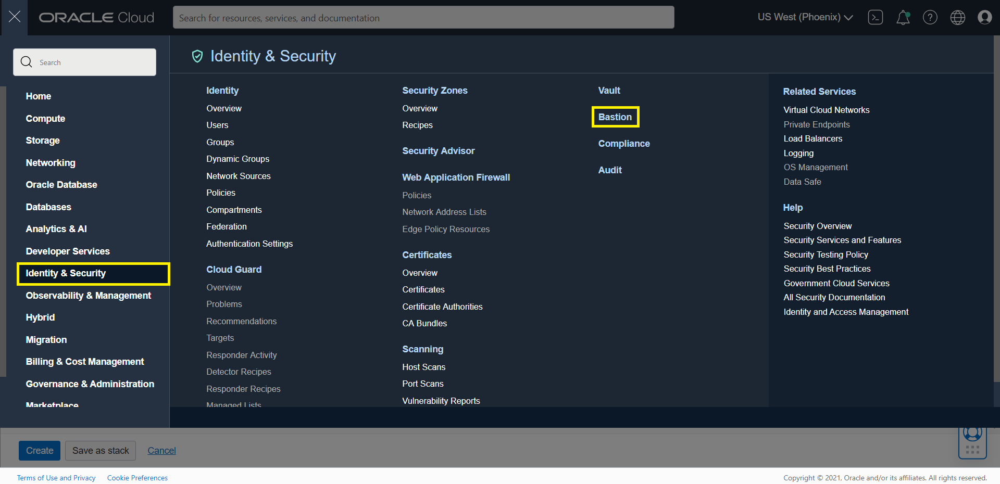
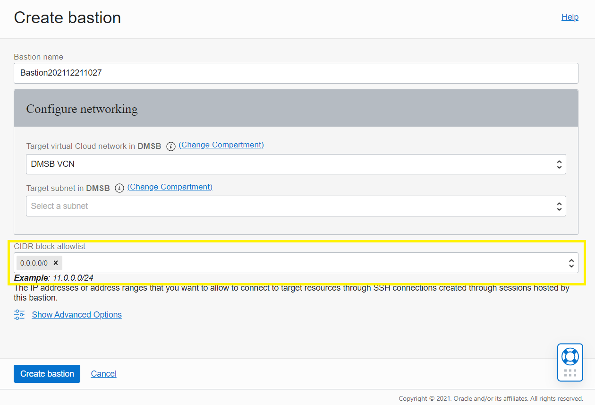

# How do you create a Bastion?

1. Access cloud.oracle.com and login to your tenancy 

2. Click the hamburger menu on the left hand side and select "Identity and Security" then "Bastion" 

4. Under List Scope, in the Compartment list, click the name of the compartment where you want to create a bastion.

Change name of Instance to your specification.

5. Click "Create Bastion"

6. Enter a name for the Bastion
	- Avoid entering any confidential information in this field. Only alphanumeric characters are supported.

7. Under Configure networking, select the Target virtual cloud network of the target resource that you intend to connect to by using sessions hosted on this bastion.
If needed, change the compartment to find the VCN.

8. Select the Target subnet. The subnet must either be the same as the target resource's subnet or it must be a subnet from which the target resource's subnet accepts network traffic.
If needed, change the compartment to find the subnet.

9. In CIDR block allowlist, add one or more address ranges in CIDR notation that you want to allow to connect to sessions hosted by this bastion.
For example, 203.0.113.0/24 or 0.0.0.0/0 to allow all.

Enter a CIDR block into the input field, and then either click the value or press Enter to add the value to the list. The maximum allowed number of CIDR blocks is 20.

A more limited address range offers better security.

10. Click "Create Bastion" 

## Acknowledgements
* **Author** - Thea Lazarova, Solution Engineer Santa Monica
* **Contributors** -  Andrew Hong, Solution Engineer Santa Monica

